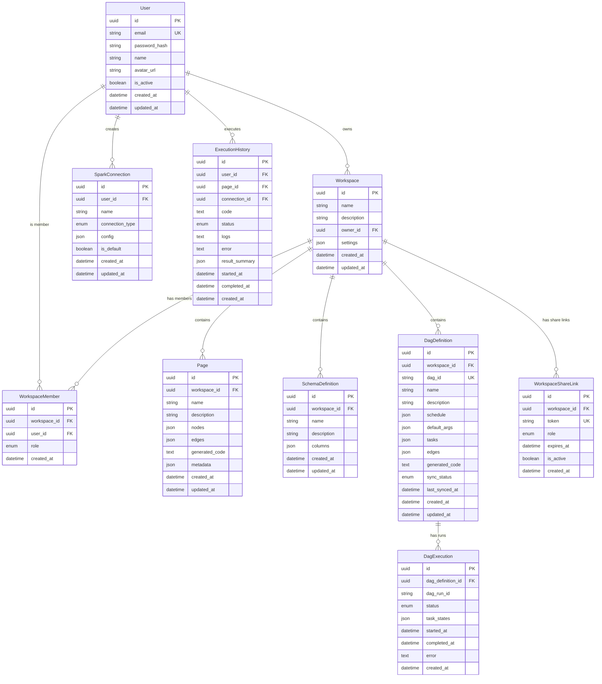

# ETLab Database Schema

This document describes the database schema used by ETLab. The application supports SQLite, PostgreSQL, and MySQL databases.

## Entity Relationship Diagram



## Tables

### User

Stores user authentication and profile information.

| Column | Type | Constraints | Description |
|--------|------|-------------|-------------|
| `id` | UUID | PRIMARY KEY | Unique identifier |
| `email` | VARCHAR(255) | UNIQUE, NOT NULL | User's email address |
| `password_hash` | VARCHAR(255) | NOT NULL | Bcrypt hashed password |
| `name` | VARCHAR(255) | | Display name |
| `avatar_url` | VARCHAR(500) | | Profile picture URL |
| `is_active` | BOOLEAN | DEFAULT true | Account status |
| `created_at` | TIMESTAMP | NOT NULL | Account creation time |
| `updated_at` | TIMESTAMP | | Last update time |

**Indexes:**
- `ix_users_email` on `email`

---

### Workspace

Container for organizing pages, schemas, and DAGs.

| Column | Type | Constraints | Description |
|--------|------|-------------|-------------|
| `id` | UUID | PRIMARY KEY | Unique identifier |
| `name` | VARCHAR(255) | NOT NULL | Workspace name |
| `description` | TEXT | | Workspace description |
| `owner_id` | UUID | FOREIGN KEY | Reference to owner User |
| `settings` | JSON | | Workspace-specific settings |
| `created_at` | TIMESTAMP | NOT NULL | Creation time |
| `updated_at` | TIMESTAMP | | Last update time |

**Relationships:**
- `owner` → User (many-to-one)
- `pages` → Page (one-to-many, cascade delete)
- `schemas` → SchemaDefinition (one-to-many, cascade delete)
- `dags` → DagDefinition (one-to-many, cascade delete)
- `members` → WorkspaceMember (one-to-many, cascade delete)
- `share_links` → WorkspaceShareLink (one-to-many, cascade delete)

**Indexes:**
- `ix_workspaces_owner_id` on `owner_id`

---

### Page

Represents an ETL pipeline with visual nodes and edges.

| Column | Type | Constraints | Description |
|--------|------|-------------|-------------|
| `id` | UUID | PRIMARY KEY | Unique identifier |
| `workspace_id` | UUID | FOREIGN KEY, NOT NULL | Parent workspace |
| `name` | VARCHAR(255) | NOT NULL | Page/pipeline name |
| `description` | TEXT | | Page description |
| `nodes` | JSON | | React Flow nodes (sources, transforms, sinks) |
| `edges` | JSON | | React Flow edges (connections between nodes) |
| `generated_code` | TEXT | | Generated PySpark code |
| `metadata` | JSON | | Additional metadata |
| `created_at` | TIMESTAMP | NOT NULL | Creation time |
| `updated_at` | TIMESTAMP | | Last update time |

**Node Structure (JSON):**
```json
{
  "id": "node-1",
  "type": "source|transform|sink",
  "position": {"x": 100, "y": 200},
  "data": {
    "label": "Read CSV",
    "config": { ... }
  }
}
```

**Indexes:**
- `ix_pages_workspace_id` on `workspace_id`

---

### WorkspaceMember

Role-based access control for workspace collaboration.

| Column | Type | Constraints | Description |
|--------|------|-------------|-------------|
| `id` | UUID | PRIMARY KEY | Unique identifier |
| `workspace_id` | UUID | FOREIGN KEY, NOT NULL | Target workspace |
| `user_id` | UUID | FOREIGN KEY, NOT NULL | Member user |
| `role` | ENUM | NOT NULL | Role: `owner`, `editor`, `viewer` |
| `created_at` | TIMESTAMP | NOT NULL | Membership creation time |

**Roles:**
- `owner` - Full access, can delete workspace
- `editor` - Can create/edit pages and schemas
- `viewer` - Read-only access

**Unique Constraint:** `(workspace_id, user_id)`

---

### WorkspaceShareLink

Shareable links for inviting users to workspaces.

| Column | Type | Constraints | Description |
|--------|------|-------------|-------------|
| `id` | UUID | PRIMARY KEY | Unique identifier |
| `workspace_id` | UUID | FOREIGN KEY, NOT NULL | Target workspace |
| `token` | VARCHAR(255) | UNIQUE, NOT NULL | Shareable token |
| `role` | ENUM | NOT NULL | Role assigned on join |
| `expires_at` | TIMESTAMP | | Link expiration time |
| `is_active` | BOOLEAN | DEFAULT true | Link status |
| `created_at` | TIMESTAMP | NOT NULL | Creation time |

---

### SparkConnection

Spark cluster connection configurations.

| Column | Type | Constraints | Description |
|--------|------|-------------|-------------|
| `id` | UUID | PRIMARY KEY | Unique identifier |
| `user_id` | UUID | FOREIGN KEY, NOT NULL | Owner user |
| `name` | VARCHAR(255) | NOT NULL | Connection name |
| `connection_type` | ENUM | NOT NULL | Type of Spark connection |
| `config` | JSON | | Connection-specific configuration |
| `is_default` | BOOLEAN | DEFAULT false | Default connection flag |
| `created_at` | TIMESTAMP | NOT NULL | Creation time |
| `updated_at` | TIMESTAMP | | Last update time |

**Connection Types:**
- `local` - Local Spark (spark-submit)
- `standalone` - Spark Standalone cluster
- `yarn` - YARN cluster
- `kubernetes` - Kubernetes cluster
- `databricks` - Databricks workspace
- `livy` - Apache Livy REST API

**Config Examples:**

Local:
```json
{
  "master": "local[*]",
  "driver_memory": "2g",
  "executor_memory": "2g"
}
```

Databricks:
```json
{
  "host": "https://xxx.cloud.databricks.com",
  "token": "dapi...",
  "cluster_id": "0123-456789-abc123"
}
```

Livy:
```json
{
  "url": "http://livy-server:8998",
  "auth": "basic",
  "username": "admin",
  "password": "..."
}
```

---

### ExecutionHistory

Tracks code execution history and results.

| Column | Type | Constraints | Description |
|--------|------|-------------|-------------|
| `id` | UUID | PRIMARY KEY | Unique identifier |
| `user_id` | UUID | FOREIGN KEY, NOT NULL | Executing user |
| `page_id` | UUID | FOREIGN KEY | Source page (optional) |
| `connection_id` | UUID | FOREIGN KEY | Spark connection used |
| `code` | TEXT | NOT NULL | Executed PySpark code |
| `status` | ENUM | NOT NULL | Execution status |
| `logs` | TEXT | | Execution logs |
| `error` | TEXT | | Error message if failed |
| `result_summary` | JSON | | Execution result summary |
| `started_at` | TIMESTAMP | | Execution start time |
| `completed_at` | TIMESTAMP | | Execution completion time |
| `created_at` | TIMESTAMP | NOT NULL | Record creation time |

**Statuses:**
- `pending` - Queued for execution
- `running` - Currently executing
- `completed` - Successfully completed
- `failed` - Execution failed
- `cancelled` - Cancelled by user

**Indexes:**
- `ix_execution_history_user_id` on `user_id`
- `ix_execution_history_status` on `status`

---

### SchemaDefinition

Reusable schema definitions for data sources/sinks.

| Column | Type | Constraints | Description |
|--------|------|-------------|-------------|
| `id` | UUID | PRIMARY KEY | Unique identifier |
| `workspace_id` | UUID | FOREIGN KEY, NOT NULL | Parent workspace |
| `name` | VARCHAR(255) | NOT NULL | Schema name |
| `description` | TEXT | | Schema description |
| `columns` | JSON | NOT NULL | Column definitions |
| `created_at` | TIMESTAMP | NOT NULL | Creation time |
| `updated_at` | TIMESTAMP | | Last update time |

**Columns Structure:**
```json
[
  {
    "name": "id",
    "type": "integer",
    "nullable": false,
    "description": "Primary key"
  },
  {
    "name": "email",
    "type": "string",
    "nullable": false,
    "description": "User email"
  },
  {
    "name": "created_at",
    "type": "timestamp",
    "nullable": true
  }
]
```

**Supported Types:**
- `string`, `integer`, `long`, `float`, `double`
- `boolean`, `date`, `timestamp`
- `binary`, `array`, `map`, `struct`

---

### DagDefinition

Stores Airflow DAG definitions created in ETLab.

| Column | Type | Constraints | Description |
|--------|------|-------------|-------------|
| `id` | UUID | PRIMARY KEY | Unique identifier |
| `workspace_id` | UUID | FOREIGN KEY, NOT NULL | Parent workspace |
| `dag_id` | VARCHAR(255) | UNIQUE, NOT NULL | Airflow DAG ID |
| `name` | VARCHAR(255) | NOT NULL | Display name |
| `description` | TEXT | | DAG description |
| `schedule` | JSON | | Schedule configuration |
| `default_args` | JSON | | Default task arguments |
| `tasks` | JSON | NOT NULL | Task definitions |
| `edges` | JSON | | Task dependencies |
| `generated_code` | TEXT | | Generated Airflow Python code |
| `sync_status` | ENUM | DEFAULT 'pending' | Sync status with Airflow |
| `last_synced_at` | TIMESTAMP | | Last sync time |
| `created_at` | TIMESTAMP | NOT NULL | Creation time |
| `updated_at` | TIMESTAMP | | Last update time |

**Sync Statuses:**
- `pending` - Not yet synced
- `synced` - Successfully synced to Airflow
- `error` - Sync failed
- `modified` - Modified since last sync

**Schedule Structure:**
```json
{
  "interval": "@daily",
  "start_date": "2024-01-01",
  "catchup": false
}
```

**Task Structure:**
```json
[
  {
    "id": "task-1",
    "type": "spark_submit",
    "name": "process_data",
    "config": {
      "page_id": "uuid-of-page",
      "connection_id": "uuid-of-connection"
    }
  }
]
```

---

### DagExecution

Tracks Airflow DAG run history.

| Column | Type | Constraints | Description |
|--------|------|-------------|-------------|
| `id` | UUID | PRIMARY KEY | Unique identifier |
| `dag_definition_id` | UUID | FOREIGN KEY, NOT NULL | Parent DAG definition |
| `dag_run_id` | VARCHAR(255) | | Airflow DAG run ID |
| `status` | ENUM | NOT NULL | Execution status |
| `task_states` | JSON | | Individual task states |
| `started_at` | TIMESTAMP | | Execution start time |
| `completed_at` | TIMESTAMP | | Execution completion time |
| `error` | TEXT | | Error message if failed |
| `created_at` | TIMESTAMP | NOT NULL | Record creation time |

**Statuses:**
- `queued` - Waiting to run
- `running` - Currently executing
- `success` - Completed successfully
- `failed` - Execution failed

**Task States:**
```json
{
  "task-1": {"state": "success", "duration": 45.2},
  "task-2": {"state": "running", "started_at": "2024-01-15T10:30:00Z"},
  "task-3": {"state": "queued"}
}
```

---

## Database Migrations

ETLab uses Alembic for database migrations. Migration files are located in `backend/alembic/versions/`.

### Running Migrations

```bash
# Apply all pending migrations
cd backend
alembic upgrade head

# Create a new migration
alembic revision --autogenerate -m "description"

# Rollback one migration
alembic downgrade -1
```

## Indexes Summary

| Table | Index Name | Columns | Purpose |
|-------|------------|---------|---------|
| users | ix_users_email | email | Email lookup, uniqueness |
| workspaces | ix_workspaces_owner_id | owner_id | Owner's workspaces |
| pages | ix_pages_workspace_id | workspace_id | Workspace pages |
| execution_history | ix_execution_history_user_id | user_id | User's executions |
| execution_history | ix_execution_history_status | status | Status filtering |

## Notes

1. **UUID Primary Keys**: All tables use UUIDs for primary keys, ensuring globally unique identifiers and supporting distributed systems.

2. **Soft Deletes**: Currently not implemented. Consider adding `deleted_at` column for audit requirements.

3. **JSON Columns**: Used for flexible, schema-less data (nodes, edges, config). Validated at application level.

4. **Cascade Deletes**: Workspace deletion cascades to pages, schemas, DAGs, members, and share links.

5. **Timestamps**: All tables include `created_at`. Most include `updated_at` for tracking modifications.
